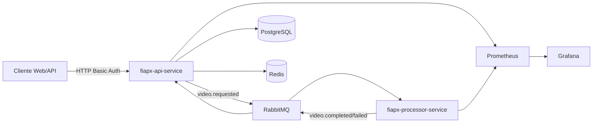

# Arquitetura — FIAP X Video Platform

## Visão geral

Sistema de processamento de vídeos composto por dois microsserviços desacoplados via RabbitMQ, com persistência em PostgreSQL, cache em Redis e observabilidade via Prometheus/Grafana.

## Decisões arquiteturais

| Decisão | Escolha | Justificativa |
|---------|---------|---------------|
| Comunicação assíncrona | RabbitMQ topic exchange | Absorve picos sem perder requisições |
| Autenticação inicial | HTTP Basic Auth | Atende requisito de usuário/senha; evoluir para JWT |
| Persistência | PostgreSQL + Liquibase | Rastreabilidade de jobs e status |
| Cache | Redis | Cache de listagem de jobs por usuário (`@Cacheable`, TTL 5 min) |
| Processamento | Worker dedicado | Escala horizontal independente da API |
| Containers | Docker Compose local | Preparado para K8s na entrega final |

## Modelo de dados

### users
- id (UUID)
- username, password_hash, email
- created_at

### video_jobs
- id (UUID)
- user_id (FK)
- original_filename, status, storage_path, output_path
- error_message, created_at, updated_at

## Eventos RabbitMQ

| Exchange | Routing Key | Produtor | Consumidor |
|----------|-------------|----------|------------|
| fiapx.events | video.requested | API | Processor |
| fiapx.events | video.processing | Processor | API |
| fiapx.events | video.completed | Processor | API |
| fiapx.events | video.failed | Processor | API |

## Escalabilidade

- API: réplicas stateless atrás de load balancer
- Processor: múltiplos consumers na fila `video.processing`
- RabbitMQ: filas duráveis garantem entrega em picos

## Monitoramento

- `/actuator/prometheus` em ambos os serviços
- Dashboard **FIAP X — Visão geral** provisionado em Grafana (HTTP, latência p95, disponibilidade)

## Projeto base

O hackathon parte de um projeto simples que extrai frames de vídeo e gera ZIP. A evolução mantém essa funcionalidade core no `fiapx-processor-service`, adicionando camadas de API, fila, persistência e observabilidade.
